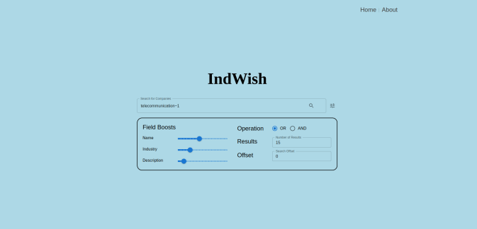
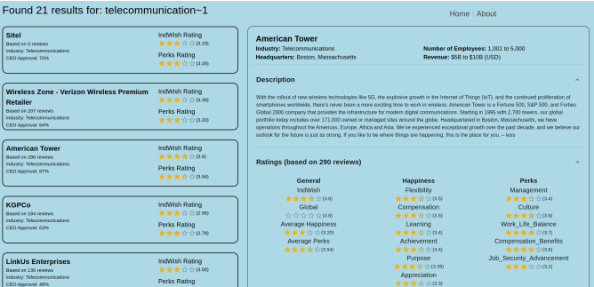
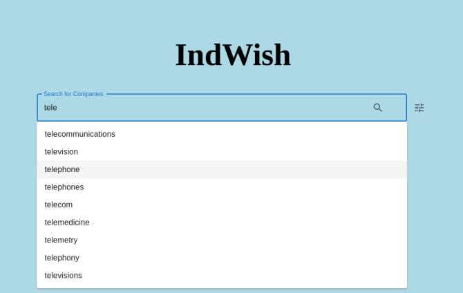

# PRI Project - IndWish
The aim of this project is to develop an Information Retrieval System, in the context of Company Reviews. This program uses thousands of company reviews to provide a search engine that allows users to find companies that match their interests and see what other people think about them.

A final report of the project with implementation details and results can be found [here](docs/milestone3/report-69.pdf).

---

## Setup & Structure
The project is divided into 3 main parts:
1. Data Preparation (`src/`) - Python scripts to clean, process and prepare the data to be imported into **Solr**. There is a **Makefile** to run the targets of this step.
2. Document Indexing and Retrieval (`solr/`) - **Solr** configuration files and scripts to import the data into the search engine.
3. User Interface (`frontend/`) - **React** application that provides a user interface to interact with the search engine and view the results.

---

## Screenshots

Homepage of the application.
 

Results Page for a query

Autocomplete functionality

